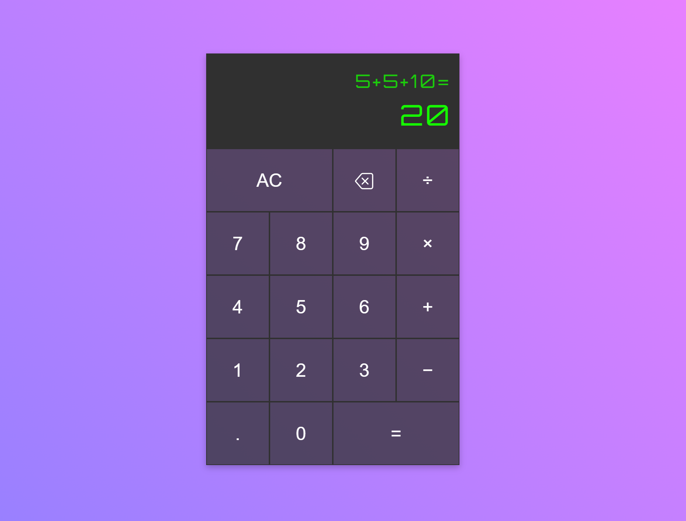

# Calculator

## Summary
This is an easy to use Calculator with simple standard functionality. Created without using eval() function.

Live Site: https://spelks.github.io/calculator/

## Features
- Able to properly chain calculations (e.g 2 + 3 - 5 etc)
- Light and Dark mode toggle button
- Accepts decimal points
- Rejects division by 0!
- 'Clear' and 'Delete' buttons
- Keyboard Responsiveness:
  * `0 - 9`: for available numbers
  * `c` or `Escape`: to clear screen
  * `Backspace`: to delete single characters
  * `=` or `Enter`: to calculate numbers
  * `+`, `-`, `*`, `/`: for operators

## Calculator Preview

